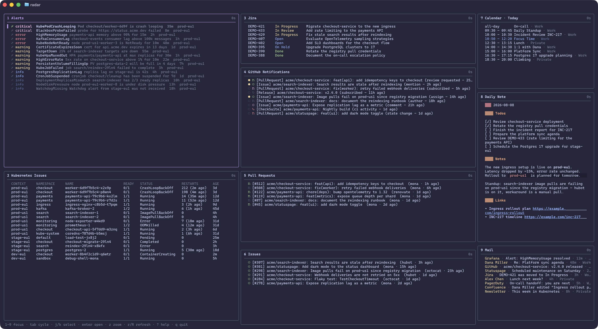

# radar

Personal AI generated TUI radar built with
[Bubble Tea](https://github.com/charmbracelet/bubbletea) — everything on your
radar in one terminal: Apple Calendar events, Apple Mail messages, the daily
note, Alertmanager.app alerts, GitHub pull requests / issues / notifications,
Jira work items, Kubernetes issues and HTTP checks in configurable dashboards.



## Install

```sh
go install github.com/ricoberger/radar@latest

# Or install from source
make build
mkdir -p ~/.config/radar && cp config.yaml ~/.config/radar/config.yaml
./radar
```

To try it without installing, run `make dev` — it uses the `config.yaml` from
this repository.

The apple-calendar panel compiles a small Swift EventKit helper (embedded in
the binary) with `swiftc` on first use and caches it under
`~/Library/Caches/radar`. The first run triggers a macOS prompt to grant your
terminal access to your calendars.

## Keybindings

| Key               | Action                                |
| ----------------- | ------------------------------------- |
| `[`/`]`           | previous / next dashboard             |
| `1`-`9`           | focus panel                           |
| `tab`/`shift-tab` | cycle focus                           |
| `j`/`k`           | select item / scroll                  |
| `g`/`G`           | first / last item                     |
| `enter`           | open / view item, edit the daily note |
| `z`               | zoom focused panel                    |
| `r`/`R`           | refresh focused / all panels          |
| `q`               | quit                                  |

## Configuration

A config file is required — without one the application exits with an error. It
is read from the first of: the `--config <config.yaml>` flag, the `RADAR_CONFIG`
environment variable, or `~/.config/radar/config.yaml`. With `radar --demo` a
built-in demo config showing every panel type with generic fake data is used
instead — no external tools or accounts needed. Only `dashboards` is required,
the remaining keys have defaults:

```yaml
# The editor which is used when a panel supports opening data in an editor.
# Defaults to the $EDITOR environment variable.
editor: nvim

# A list of dashboards, each with a name and a layout. The layout is a tree of
# rows and columns, each with a weight (flex ratio, default 1) and children.
# Each leaf node is a panel with a type, an optional title, an optional refresh
# interval (in seconds) and optional type-specific params.
dashboards:
  - name: Demo
    layout:
      direction: row
      children:
        - direction: column
          weight: 2
          children:
            - direction: column
              children:
                - panel: httpmonitor
                  params:
                    targets:
                      - name: Website
                        url: https://acme.com
                      - name: API
                        url: https://api.acme.com/health
                - panel: alertmanager
                  weight: 2
                  params:
                    filter: all
            - direction: column
              children:
                - panel: kubectl-issues
                  params:
                    command: pods
                    contexts:
                      - prod-eu1
                      - stage-eu1
                      - dev-eu1
                    args:
                      - '-A'
        - direction: column
          weight: 2
          children:
            - direction: column
              children:
                - panel: jira
                  params:
                    jql: assignee = currentUser()
                - panel: github-notifications
                  weight: 2
            - direction: column
              children:
                - panel: github-prs
                  params:
                    query: author:@me is:open
                - panel: github-issues
                  params:
                    query: assignee:@me is:open
        - direction: column
          children:
            - panel: apple-calendar
            - panel: ricoberger-notes
              weight: 2
              params:
                dir: '~/notes'
            - panel: apple-mail
```

### Panels

#### `apple-calendar`

The `apple-calendar` panel shows a single day by default: `day` selects
`yesterday`, `today` (default) or `tomorrow`. With `view: week` it shows the
full week (Monday–Sunday, today highlighted, multi-day events repeated under
every day they cover) and `day` is ignored. The default title reflects the
configuration (e.g. `Calendar · Tomorrow`, `Calendar · Week`); an explicit
`title` always wins. Events that are currently running are shown in blue.

For this panel to work, `swiftc` must be available (Xcode Command Line Tools)
and the terminal must be granted access to your calendars.

```yaml
- panel: apple-calendar
  title: Calendar · Today
  interval: 300
  params:
    view: day
    day: today
```

#### `apple-mail`

The `apple-mail` panel shows the newest `limit` (default `10`) messages across
the inboxes of all accounts as `sender · subject · age · account`. `messages`
selects `unread` (default) or `all`. `include` / `exclude` are lists of account
names (as shown in Mail.app) to fetch from; if both are set they are ignored and
all accounts are fetched.

For this panel to work, Mail.app must be running.

```yaml
- panel: apple-mail
  title: Mail
  interval: 300
  params:
    messages: unread
    limit: 10
    include:
    exclude:
```

#### `ricoberger-notes`

The `ricoberger-notes` panel shows a daily note from `dir` (required, layout
`<dir>/YYYY/MM/YYYY-MM-DD.md`, created from `<dir>/template.md`): `day` selects
`today` (default) or `yesterday`. The note is rendered as Markdown with the
[`md`](https://github.com/ricoberger/md) binary if it is on the `PATH` (YAML
frontmatter is stripped), otherwise as plain text. Enter opens the note in the
configured editor; yesterday's note is never created retroactively.

```yaml
- panel: ricoberger-notes
  title: Daily Note
  interval: 300
  params:
    dir: '~/notes'
    day: today
```

#### `alertmanager`

The `alertmanager` panel shows the alerts of one
[Alertmanager.app](https://github.com/ricoberger/Alertmanager) filter or
alertmanager: exactly one of `filter` / `alertmanager` (the name as shown in the
app) is required. `url` sets the API base URL (default `http://127.0.0.1:9093`).
Each row shows the analysis state (green = analysis exists, yellow = running),
severity, name, summary, age and alertmanager; suppressed alerts are dimmed.
Keys on the selected alert: `enter` view the alert Markdown in the editor,
`o`/`s`/`b`/`d`/`p` open the source / silence / runbook / dashboard / panel link
in the browser (ignored when the alert has no such link), `a` open the finished
analysis in the editor or start a new run, `y` copy the source URL to the
clipboard.

```yaml
- panel: alertmanager
  title: Alerts
  interval: 60
  params:
    url: http://127.0.0.1:9093
    filter:
```

#### `github-prs`

The `github-prs` panel lists the results of a `gh search prs` query (`query` is
required, `limit` defaults to `20`), using the fzfgh row layout with
state-colored icons. `open` selects what enter does: `browser` (default) opens
the pull request in the web browser, `fzfgh` opens it in
[fzfgh](https://github.com/ricoberger/dotfiles/blob/main/.local/bin/fzfgh).

```yaml
- panel: github-prs
  title: Pull Requests
  interval: 300
  params:
    query:
    limit: 20
    open: browser
```

#### `github-issues`

The `github-issues` panel lists the results of a `gh search issues` query;
params and behavior match the github-prs panel.

```yaml
- panel: github-issues
  title: Issues
  interval: 300
  params:
    query:
    limit: 20
    open: browser
```

#### `github-notifications`

The `github-notifications` panel lists all notifications, read and unread, from
the
[gh-notifications](https://github.com/ricoberger/dotfiles/blob/main/.local/bin/gh-notifications)
helper (`limit` defaults to `50`). `open` selects what enter does: `browser`
(default) opens the notification in the web browser, `fzfgh` opens pull requests
and issues in
[fzfgh](https://github.com/ricoberger/dotfiles/blob/main/.local/bin/fzfgh)
(other notification types still open in the browser).

```yaml
- panel: github-notifications
  title: GitHub Notifications
  interval: 300
  params:
    limit: 50
    open: browser
```

#### `jira`

The `jira` panel lists the work items of a `jql` query (required, `limit`
defaults to `50`) via [acli](https://developer.atlassian.com/cloud/acli/), in
server order. Each row shows the key, the status (colored by its status
category) and the summary, like fzfjira. Keys on the selected work item: `enter`
assemble the work item as a Markdown document (metadata, description, comments,
sub-tasks and links; ADF fields are converted with
[`md`](https://github.com/ricoberger/md)) and open it in the configured editor,
`o` open the work item in the web browser, `y` copy the key to the clipboard.
`flagField` sets the custom field backing the "Flagged" marker (default
`customfield_10002`).

```yaml
- panel: jira
  title: Jira
  interval: 300
  params:
    jql:
    limit: 50
    flagField: customfield_10002
```

#### `kubectl-issues`

The `kubectl-issues` panel runs
`kubectl issues <command> [--context ...] [args ...] -o json` via the
[kubectl-issues](https://github.com/ricoberger/kubectl-issues) plugin and
renders the result as a table (dimmed header, columns like the CLI output).
`command` is the subcommand (e.g. `pods`, `deployments`, `nodes`), `contexts` is
a list of kubeconfig contexts (omitted = current context) and `args` is passed
through verbatim; `-o` / `--output` is rejected since the panel always requests
JSON.

```yaml
- panel: kubectl-issues
  title: Kubernetes Issues
  interval: 60
  params:
    command:
    contexts:
    args:
```

#### `httpmonitor`

The `httpmonitor` panel checks a list of HTTP targets (like
[httpmonitor](https://github.com/ricoberger/httpmonitor)) and renders one row
per target with the status code (green = 2xx/3xx, yellow = 4xx, red = 5xx or
`0` for failed checks) and the timings of the different phases: total, DNS
lookup, TCP connection, TLS handshake, server processing and content transfer.
Every check uses a fresh connection, redirects are not followed and a `-` marks
a phase that did not happen. Each target requires a `name` and a http(s) `url`;
optional per target: `method` (default `GET`), `body`, `username` / `password`
(basic auth, takes precedence over `token`), `token` (bearer auth), `insecure`
(skip TLS verification) and `timeout` (seconds, default `2`). `enter` opens the
selected target in the browser.

```yaml
- panel: httpmonitor
  title: HTTP Monitor
  interval: 10
  params:
    targets:
      - name:
        url:
```

## Release

To release a new version run the following commands:

```sh
git tag v<major>.<minor>.<patch>
git push && git push --tags
```
